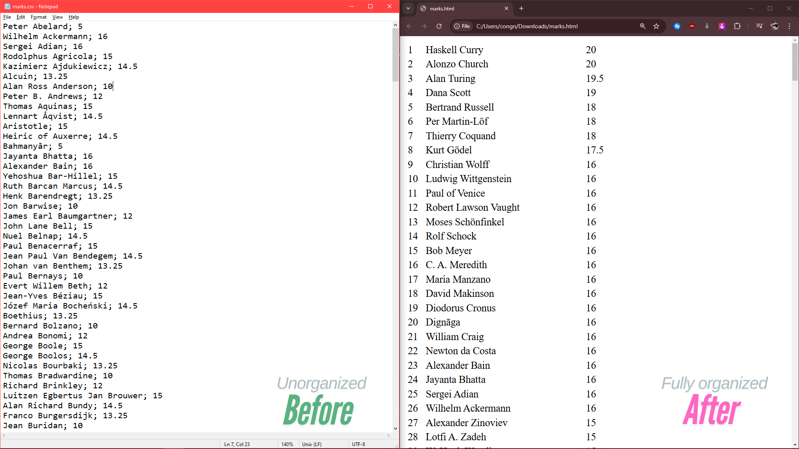

# Table Processing & Conversion Toolkit

A functional programming library written in **Idris** for processing tabular data. Handles CSV parsing, HTML rendering, sorting, and ranking — with data shape constraints enforced at compile time by Idris's dependent type system.



## What it does

- Parses CSV files into typed table structures
- Converts tables to formatted HTML
- Sorts rows by any column
- Computes rankings across rows

## Why Idris

Idris is a dependently-typed functional language — types can depend on values, which means things like "a table must have exactly N columns" can be expressed and verified at compile time. Bugs that would be runtime crashes in Python are caught before the program runs.

## Running it

Requires the [Idris 2](https://www.idris-lang.org/) compiler.

```bash
idris2 --build main.ipkg
./build/exec/main
```

The `marks.csv` file in the root is used as sample input. The converted `marks.html` is the expected output.

## Project structure

```
src/
├── Converter.idr   — CSV ↔ HTML conversion logic
└── Main.idr        — Entry point and example usage
main.ipkg           — Idris package file
marks.csv           — Sample input
marks.html          — Sample output
```

## Tech

- Idris 2 (dependently-typed functional language)
- Pure functional style — no mutation, no side effects in core logic
